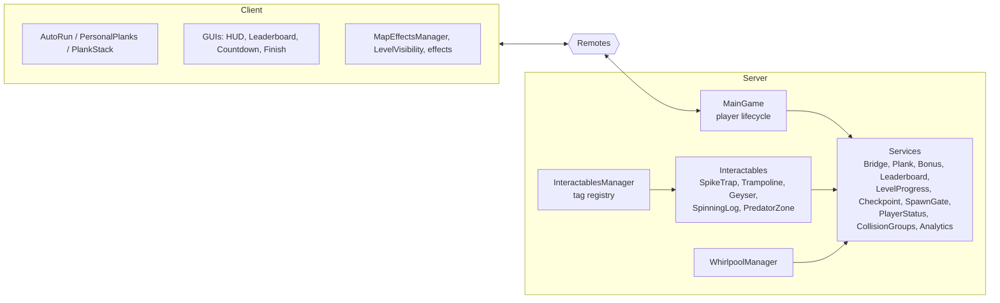

# 🌉 Plank Rush


A multiplayer Roblox runner. Collect planks, walk out over the water building your bridge as you go, get through traps and hazards, and race other players to the finish.

**[▶ Play on Roblox](https://www.roblox.com/games/97476080303924/Plank-Rush)**

Built solo: server and client code, game systems, UI and level layout.

---

## Gameplay

- Collect planks scattered across the map. Walking over water places them automatically and builds your bridge
- Run out of planks over water and you fall in. Respawn at your last checkpoint
- Bonus walls multiply your planks, penalty walls take a share away
- Hazards: spike traps, geysers, swinging logs, whirlpools, current zones that push you downstream, and predator-fish zones that bite and steal planks
- Trampolines launch you across gaps
- The map is split into levels. Finishing a level unlocks the next one and moves your respawn point forward
- Global leaderboard of best times, plus a live list of players currently running

---

## Client

- Auto-run with mobile and desktop input handling
- Carried plank stack mirrored on other players and scattered on death or trap hits
- Animations (trampoline flip) synced across clients
- Live leaderboard with client-side timer interpolation
- Per-client level visibility: locked levels stay hidden until unlocked

---

## Architecture



- `MainGame` owns the player lifecycle (spawn, death, respawn, cleanup) and delegates everything else to single-purpose services under `MainGame/Services`. Each system can be reasoned about on its own, without tangling unrelated features together
- Interactive map objects are found through `CollectionService` tags and started by `InteractablesManager`; each mechanic is its own module
- The client never decides gameplay outcomes: pickups, bonuses, level access and admin data are validated on the server

---

## Technical Decisions

**Tag-driven interactables.** Traps, bonuses, trampolines, current zones and similar map objects are found by `CollectionService` tag and configured with attributes. Placing another instance of an existing trap needs no code; a new trap type is one module in `Interactables/` plus one line in the registry. Level building stays out of the code.

**Object pooling.** Cloning a part for every placed plank caused visible frame spikes. `PlankPool` is a generic per-player pool: 100 parts pre-allocated in batches of 20 per frame, then acquired and released. It knows nothing about bridges; `BridgeService` decides what the pooled parts mean (including letting them drift in current zones).

**Water detection.** Each player has a personal water collider and a raycast-based check, cached for a few frames. A `SafeGround` tag whitelist takes precedence, so shorelines and spawn areas don't cause false drownings.

**Reliable DataStore saves.** A plain `SetAsync` loses data under throttling. Records go through an async save queue with exponential backoff retry; `UpdateAsync` keeps the better time if two writes race, and `BindToClose` flushes on shutdown. The top-20 board is read from an `OrderedDataStore`, and refreshes are coalesced so repeated finishes don't spam the store.

**Level gating in two layers.** Solid level geometry is blocked physically with collision groups (a player at stage N can't collide with geometry of level N+1 and above). Trigger parts have `CanCollide = false`, so collision groups can't stop them; every hazard checks `LevelProgress.HasAccess` itself. The client hides locked levels with `LocalTransparencyModifier`.

**Spawn gate: loading time doesn't count.** On every spawn the character is frozen and the run timer stays paused until the client confirms it's in control (`SpawnGate`, `PlayerStatus`). The first spawn shows a countdown, respawns confirm silently. Load time never ends up in a run time.

**One entry point for lethal hits.** `LethalHit.Kill` runs the same sequence for every lethal trap: scatter carried planks, fire the death remotes, then zero health, optionally after a delay. The order matters, because the client clears the carried stack when it sees the death event, so the scatter signal has to land first. `PlankPenalty` covers the non-lethal cases (full scatter, partial steal).

**Predator zones scale with activity, not trap count.** An idle fish patrols on a slow shared loop (15 ticks/s). A zone with a player inside moves to a per-frame chase loop. Cost follows the number of players being chased, not the number of zones on the map.

**Client-server sync without spam.** The leaderboard timer is interpolated locally every frame, while the server only broadcasts on actual state changes (start, pause, finish).

**Admin tooling that never trusts the client.** Session analytics (join time, attempts, finish status, region) are stored in a separate DataStore and exposed through a `RemoteFunction`. The server handler checks the caller's `UserId` against an allowlist before returning anything. The in-game panel (toggle with `L`) destroys itself on the client for anyone outside the allowlist, but the real access control lives on the server.

---

## Tools & Workflow

- Rojo project file and sourcemap for Luau LSP in VS Code
- Git + GitHub for version control
- Claude via Roblox Studio MCP for code review, refactoring and debugging; design and implementation decisions are mine

---

## Design Document

Planned features (game modes, per-level leaderboards, save system, UI flow) are described in [DESIGN.md](./DESIGN.md).

---

## Project Structure

```
ReplicatedStorage/
├── CountdownState
└── DevConfig                      (copy DevConfig.example.luau and fill in your own UserId; gitignored)

ServerScriptService/
├── FinishTrigger
├── LevelEnds
├── AnalyticsAdmin
├── WhirlpoolManager
└── MainGame/
    └── Services/
        ├── AnalyticsService
        ├── BonusService
        ├── BridgeService
        ├── CharacterLock
        ├── CheckpointService
        ├── CollisionGroups
        ├── CurrentZones
        ├── LeaderboardService
        ├── LethalHit
        ├── LevelProgress
        ├── PlankPenalty
        ├── PlankPool
        ├── PlankService
        ├── PlayerStatus
        ├── SpawnGate
        └── InteractablesManager/
            └── Interactables/
                ├── Geyser
                ├── PredatorZone
                ├── SpikeTrap
                ├── SpinningLog
                └── Trampoline

ServerStorage/
└── Whirlpool

StarterCharacterScripts/
├── AutoRun
├── PersonalPlanks
└── PlankStack

StarterPlayerScripts/
├── BonusEffectClient
├── CameraLocal
├── DrownEffect
├── LevelTransitionEffect
├── LevelVisibility
├── PlankScatterEffect
├── SoundClient
├── MapEffectsManager/
│   └── Effects/
│       ├── CurrentWaterEffect
│       └── TrampolineEffects
└── Modules/
    └── PlankVisualsRegistry

StarterGui/
├── AdminAnalyticsGui
├── CountdownGui
├── FinishScreen
├── HudGui
└── LeaderboardGui
```
